# ASQ-UAL：CS-MNLD 应变平滑与非局部损伤耦合的自适应求解框架 — 技术报告

> **模块**: `asq/`（预处理、UAL 核心、自适应、后处理）｜**验证基准**: Jin, Li & Chen 2024《A novel phase-field monolithic scheme for brittle crack propagation based on the limited-memory BFGS method with adaptive mesh refinement》(IJNME 125(22):e7572; SNT/SNS/TPB 图表数字化锚点) + Saji, Pantidis & Mobasher 2025《Modified non-local damage model: resolving spurious damage evolution》(arXiv:2506.24099; MNLD 本构与 L 形板构型)
> **状态**: 全部验证完成 — SNT −2.3%/+1.8%, SNS +2.7%/+6.6%, TPB +5.3%/−1.3%（峰值载荷/峰值位移误差）；
> 横向对比 CGD/MNLD/SC-MNLD（Jin 材料 + L 形板）与纵向对比（位移法/原始 UAL）见 §2、§5

---

## 目录

1. [核心框架（流程图 + 伪代码）](#1-核心框架)
2. [横向与纵向对比](#2-横向与纵向对比)
3. [完整理论推导](#3-完整理论推导)
4. [模块化 Python 实现](#4-模块化-python-实现)
5. [算例验证与定量对比](#5-算例验证与定量对比)

---

## 1. 核心框架

### 1.1 总体架构

```
┌────────────────────────────────────────────────────────────────────────┐
│                         ASQ-UAL 求解框架                                │
│                                                                        │
│  预处理 (asq/quadtree.py, asq/sfem.py)                                 │
│  ├─ 四叉树网格：Slit 裂缝描述、悬挂节点、2:1 平衡                        │
│  ├─ CS-FEM 预计算：子胞三角化 + 平滑应变算子 (sB/sT/sG/sM/sD/sA/sC)      │
│  └─ 稀疏装配模式（固定行结构，JIT 编译）                                 │
│                                                                        │
│  UAL 核心 (asq/model.py, asq/kernels.py)                               │
│  ├─ 本构：CGD / MNLD / SC-MNLD（隐式梯度非局部）+ AT2 相场（谱分解）      │
│  ├─ 相位A：位移控制 Newton（q 控制器 → 损伤起始）                         │
│  ├─ 相位B：过程区加权弧长法（PZ-UAL）                                    │
│  │    g(y) = w·Δy − τ = 0,  w = 过程区质量权重（标量自由度）              │
│  └─ 位移控制回退（位移法再播种 τ）+ 停滞检测                              │
│                                                                        │
│  自适应模块 (asq/quadtree.py + model.adapt)                             │
│  ├─ 尺寸场：过程区点云（d≥d_thr 或 ψ≥0.5ψc）→ h(x) = clamp(h_min,        │
│  │        h_min + grade·dist, h_max)，缓冲半径 r_buf                     │
│  ├─ 预测-校正 AMR：细化→传递(节点插值+子胞历史继承)→冻结再平衡→重解        │
│  └─ 2:1 平衡 + 悬挂节点约束（CS-FEM 天然支持多边形胞）                    │
│                                                                        │
│  后处理 (run_bench.py)                                                  │
│  └─ 反力-位移曲线、损伤云图、裂纹路径、DoF/时间/AMR 指标、JSON 存档        │
└────────────────────────────────────────────────────────────────────────┘
```

### 1.2 求解流程（两阶段驱动）

```text
初始化:  网格 → CS-FEM 算子 → 状态 (U, H/kappa) = 0
─────────────────────────────────────────────────────
相位A (位移控制, 至损伤起始):
  loop:
    1. 目标 λ ← λ + Δλ (q 控制器: q = H_max/ψc;
       q<0.5 → Δλ×2 (上限 0.05 λ_end); Δq>0.2 → Δλ×0.2/Δq)
    2. nr_fixed(λ): 位移控制 Newton(线搜索), 收敛→提交历史
    3. AMR: 若尺寸场触发细化 → 传递 + 冻结再平衡 (增量为陈旧 → 清除播种)
    4. 若 d_max > onset_d (PF: 0.05, GD: 5e-3) 或 q>1.2 → 进入相位B
─────────────────────────────────────────────────────
相位B (PZ 加权 UAL):
  播种:  τ₀ = w·Δy(最后一步相位A增量);  (Δy_prev, Δλ_prev) 同源
  loop (step < max_steps 且 λ < λ_end 且 t < wall_max_s):
    for attempt in 1..14:
      1. 预测: Δy = s·Δy_prev, s = τ/(w·Δy_prev)  (护栏: 0<s≤50)
         退化时再播种 Δλ_seed = min(1e-4·λ_end, τ) (随 τ 收缩!)
      2. Newton 校正 (增广系统 [J  q; wᵀ 0]·[δy; δλ] = −[r; g])
         收敛: ‖r‖ ≤ max(1e-6·‖r_pred‖, 1e-11) 且 |g| ≤ 1e-6·τ
         线搜索 η ∈ {1, .5, .25, .1, .03, .01},
         接受条件 ‖r(η)‖ < max(‖r‖, 2e-11)  ← 机器底线(平衡态上不可能严格下降)
      3. attempt≥8 → 球面约束回退: ‖Δy‖²+ν₂Δλ² = dl²·N (dl 取上一步增量 0.5 倍,
         失败时 dl×0.5) —— 无需过程区权重, 可绕极限点
      4. 根过滤器(物理判据): 单步最大损伤跳跃 > 0.5 → 拒绝, τ×0.5
         (相对增量过滤器在极限点误杀合法大切线步, 已弃用)
      5. 试探接受 → AMR 预测-校正 (细化则回滚重试, 增量以传递后状态重启)
    全部失败 → 位移控制回退:
      Δλ_fb = 0.5|Δλ_prev| (上限 0.05λ_end), nr_fixed(tol=1e-7)
      成功 → 再播种 τ = min(0.5·w·Δy_fb, 0.2·w.sum()), 记录 F
    接受 → 提交历史, 步长控制: it≤4 → τ×10^0.2 (上限 min(τ_max, 0.2 w·1)),
                                it≥12 → τ×10^-0.2
    每 10 步转储 results/<name>_rec_partial.json (崩溃安全)
    终止: λ≥λ_end 或 (记录数>12 且 F < f_end_frac·F_peak, 默认 2%)
          或 停滞(20步无进展) 或 墙钟预算 wall_max_s
```

### 1.3 关键设计决策（与失效模式的对应）

| 失效模式 | 机制 | 对策（实现于 `asq/model.py`） |
|---|---|---|
| 损伤起始处的 brutal 核化 | 相场/陡软化本构在峰值处切线奇异 | 相位A 位移法越过核化 + PZ-UAL 接管软化段 |
| 弧长约束退化 (w·Δy_prev≈0) | 裂纹贯通后过程区质量塌缩 | 预测器护栏 s≤50 + 位移回退再播种 |
| **极限点/折点冻结** (位移±δλ 均无平衡) | 峰后分支在 (U,λ) 空间折叠, \|dyB\|→∞ | 机器底线的线搜索 + 深回退 η∈{1,…,0.01} + **球面弧长回退** + 随 τ 缩放的再播种 |
| 历史场污染 | 试探迭代把 H/κ 棘轮式抬高 | **函数式历史**: 装配只写暂存缓冲，仅在接受状态提交 |
| 全域塌缩伪解 | "全部断裂"是自由系统的一个平衡态 | 历史修复后消失; 另设根过滤器 + 停滞检测 |
| 位移回退过冲 | τ 与 λ 单位混用 | 步长由 Δλ_prev 推导并封顶 0.05λ_end |

---

## 2. 横向与纵向对比

### 2.1 对比设计

**横向**（同一 Jin 材料、同一定标：σc、Gf 双匹配）：

| 模型 | 本构 | 定标 | 特征 |
|---|---|---|---|
| AT2-PF (Jin 基准) | 谱分解 + 历史场 | (gc, l) 给定 | 裂纹带 4l≈0.03 mm |
| CGD (UAL 原文基线) | Mazars, g=1−d, α=0.7 | σc 匹配; **Gf 无界**(残余 (1−α)σc) | 带 ~0.35 mm, 永不断裂 |
| MNLD (论文模型) | f_a=d²/2−d_prev²/2, 0.8 幂过渡 | σc + Gf 匹配 (lc=0.0323) | 带 0.224 mm, 残余 4%σc |
| SC-MNLD (本文) | 状态函数 g* + C1 Hermite 过渡 | σc + Gf 匹配 (lc=0.0122) | 带 0.080 mm, 完全分离 |

**纵向**（本框架 vs 原始 UAL/位移法）：
- 原始 UAL（球面/全局弧长）在 brutal 核化处步长崩溃；
- PZ 加权弧长以过程区自由度为控制量，软化段自动细化；
- 位移控制无法跨越载荷跌落/回跳（snapback），本框架以 PZ-UAL 追踪（SNT 相场全程捕捉到 λ 回退）。

### 2.2 效率对比（Jin 2024 报告值 vs 本框架）

| 算例 | Jin 2024 (L-BFGS+AMR) | 本框架 (CS-FEM+PZ-UAL+AMR) |
|---|---|---|
| SNS | AMR: 3792→19002 DoF, 761 s (16核) | 1833→**15258** DoF (均值 7478), **921 s** (单核) |
| SNT | 预细化: 16401 DoF, 169 s (16核) | 1288→5646+ DoF (含回跳分支), ~35 min (单核, 追踪至 F≈0.4F_peak) |
| TPB | AMR: 14862→39477 DoF, 8240 s (16核) | 3624→**4920** DoF (h=0.0031 同 Jin), **78 s** (单核) |

> 注：Jin 的壁钟时间在 16 核笔记本 (TBB 并行)；本框架单核 NumPy/SciPy。

### 2.3 定量结果汇总

| 算例 | 模型 | F_peak | u_peak | vs 基准 | DoF | 时间 |
|---|---|---|---|---|---|---|
| SNT | AT2-PF | 0.7393 | 0.00601 | Jin 0.7565@0.0059 (**−2.3%/+1.8%**) | →19518 | 2274 s |
| SNS | AT2-PF | 0.5612 | 0.01024 | Jin 0.5466@0.0096 (**+2.7%/+6.6%**) | →15258 | 921 s |
| TPB | AT2-PF | 0.03992 | 0.04638 | Jin 0.0379@0.047 (**+5.3%/−1.3%**) | →4920 | 78 s |
| SNT | CS-CGD | 1.1539 | 0.00970 | +56% vs AT2 | →2451 | 11 s |
| SNT | CS-MNLD | 1.2219 | 0.00971 | +65% vs AT2 | →2694 | 11 s |
| SNT | CS-SC | 0.6682 | 0.00516 | −10% vs AT2 | →9594 | 550 s |
| SNS | CS-CGD | 0.8326 | 0.01627 | +48% vs AT2 | →2937 | 12 s |
| SNS | CS-MNLD | 0.8451 | 0.01378 | +51% vs AT2 | →2778 | 12 s |
| SNS | CS-SC | 0.4006 | 0.00641 | −29% vs AT2 | →15012 | 1636 s |

> 完整曲线/云图/记录: `results/<case>_{rec.json,snap.pkl,_curve.png,
> _damage.png}`; L-shape (MNLD 论文算例) 见 §5.3 末。

---

## 3. 完整理论推导

### 3.1 记号与自由能

域 Ω ⊂ R²，位移 **u**，损伤 d∈[0,1]。小应变 ε(u)，平面应力/应变各向同性 C。

**AT2 相场**（Miehe 谱分解）：

  E(u,d) = ∫_Ω g(d) ψ⁺(ε) + g(d) ψ⁻(ε) + gc[ d²/(2l) + l|∇d|²/2 ] dV,
  g(d) = (1−d)² (+数值下限),  ψ⁺ = ½ Σᵢ ⟨εᵢ⟩⁺σᵢ⁺

**非局部损伤**（隐式梯度，Peerlings 形式）：

  ε̄ − c ∇²ε̄ = ε 于 Ω,  ∂ₙε̄ = 0 于 ∂Ω,  c = lc²/2
  κ = max hist ε̄,  σ = g_eff(d(κ), d_prev)·C·ε
  弱形式: ∫ δε̄ ε̄ + c ∇δε̄·∇ε̄ dV = ∫ δε̄ f_r·ε_eq dV

### 3.2 谱分解的解析切线（含零应变极限）

主应变 (m = ½(exx+eyy), R = √(¼(exx−eyy)² + ¼γxy²))：

- m > R（双拉）: C⁺ = C, C⁻ = 0
- m < −R（双压）: C⁺ = 0, C⁻ = C
- |m| ≤ R（混合）: 对拉主方向 t̂ = (cosθ, sinθ)，θ = atan2(γxy, exx−eyy)：
  C⁺ = C_tt (t̂⊗t̂⊗t̂⊗t̂ 的平面投影), C⁻ = C − C⁺
- **m = 0（精确零应变）**: 切线方向不定，取 C⁺ = C⁻ = ½C（对称平均）。
  该极限保证初始状态（内部单元 ε≡0）的切线非奇异 — 这是从
  "奇异 Jff" 失效中推导出的必要条件。

### 3.3 CS-FEM（胞基应变平滑，βCS 离散）

对每个四叉树胞（含悬挂节点的多边形）做 Delaunay 子三角化（≤8 顶点），
子胞 s 上的平滑应变梯度算子：

  B̄_s = (1/A_s) ∫_{Ω_s} N_,x dΩ  （由子三角形的 Gauss 求积闭式计算）

平滑能量 + β 稳定化（防零能模量）：

  a_e(u,v) = Σ_s A_s [ ε̄_s(u)ᵀ C ε̄_s(v) + β ε̃_s(u)ᵀ C ε̃_s(v) ],
  ε̃_s = ε_s − ε̄_s （子胞应变对胞平均的偏离）

**标量场（ε̄ 或 d）**同样采用胞平滑质量/梯度算子（sM/sG），损伤历史存于**子胞**
（积分点级），与 CS-FEM 的子胞积分自然一致。

### 3.4 本构：CGD / MNLD / SC-MNLD

损伤律（Mazars 型基底 + 变体分支，κ_trans = s2·ε_D, κ_final = s1·κ_trans）：

- CGD: d = dmax·[1 − ε_D(1−α)/κ − α e^{−β(κ−ε_D)}]，g = 1−d
- MNLD: 基底支 + κ∈(κ_trans, κ_final) 上 d = D_t + (1−D_t)·ξ^{0.8}，
  g = (1−d) + d²/2 − d_prev²/2 （**增量式退化**, 论文 arxiv 2506.24099）
- SC-MNLD: φ(d) = a d^p (1−d)^s，h = 1−d+φ，q = 1−d^m，
  g* = h·q + κ_s；过渡段为 **C1 Hermite**（切线连续 → Newton 更稳）

**1D 定标**（`calib1d.py`，与 2D 同一套弱形式约定）：

- 强度：均匀解 σ(κ) 峰值 = σ_c(AT2) = 0.3247√(E·gc/l) → ε_D
  （平面应力: σc = 2823 MPa, ε_D = 1.3444e-2）
- 断裂能：长杆局部化解的耗散积分 Gf = ∫_x D(κ(x))dx, D = ∫ Y·dd dκ
  → 反解 lc（MNLD 0.0323, SC 0.0122; 形状参数取论文值 s1=1.5, s2=9, α=0.96,
  β·ε_D=4 使峰值恰在起始点）
- **CGD 的 Gf 无界**（σ→(1−α)σc 平台）：取 lc = MNLD 值作带宽对齐，并作为
  横向对比中 CGD 的结构性缺陷记录
- 杆解采用带中心弱化 (0.7ε_D) + 带开度弧长的自适应扫掠：ε_D→ε_c 的脆性定标下
  无弱化杆的远场恰在峰值到达 ε_D，全场耗散 O(L·D(ε_D)) 会污染测量 —
  这是 1D 定标的一个关键数值细节

### 3.5 过程区加权弧长（PZ-UAL）

增广系统（自由增量 Δy = (Δu_free, Δd_free), Δλ）：

  R(y,λ) = 0,   g(Δy) = wᵀΔy − τ = 0

  [J_ff  q] [δy ]   [−r]
  [wᵀ   0] [δλ ] = [−g],   q = ∂r/∂λ = −J[f, presc]·v_pat

过程区权重（**加权 UAL** 的核心）：

  w_j = M_lump(v)  当 v 的子胞满足 PZ 判据
  PZ 判据: GD: ε̄ ≥ θ ε_D 或 d ≥ d_thr;  PF: d ≥ d_thr 或 ψ⁺ ≥ ½ψc

即弧长以**过程区内标量自由度的质量加权和**为控制量：核化前 PZ 由弹性
ε̄ 云定位（裂纹在哪里将发生），贯通后 PZ 收缩为裂纹带本身 — 权重随物理
过程自动迁移，全程以单一 PZ 约束推进（原 UAL 需在球面↔局部模式间人工
切换；本框架仅在极限点 PZ 弧长尝试失败时才以球面约束作鲁棒性回退）。

### 3.6 SDF 四叉树自适应（预测-校正）

尺寸场（SDF 距离函数来自过程区点云 P）：

  h(x) = clip( h_min + grade·dist(x, P), h_min, h_max ),
  dist 以 r_buf 外延（缓冲带保证带前沿始终有解析度）

流程（每个载荷步内）：
1. 由当前解提取 PZ 点云 → h(x)
2. `refine_by_size_function` 细化（递归直到所有胞满足 h_e ≤ h(x_c)）
3. 2:1 平衡（悬挂节点层差 ≤1）
4. 状态传递：节点场（u, d/ε̄）双线性/重心插值 + **子胞历史继承**
   （新子胞在旧网格中定位祖先胞，子胞级 κ/H/d_prev 传递）
5. 冻结再平衡：固定历史做 Newton 再平衡（位移法, tol=1e-7）
6. 若细化发生：本步增量作废，UAL 以传递后的试探增量重启

---

## 4. 模块化 Python 实现

### 4.1 文件组织

```
asq/
├── quadtree.py   四叉树 + Slit + Mesh（悬挂节点、裂缝复制节点、定位）
├── sfem.py       CS-FEM 预计算（numba）: sB/sT/sG/sM/sD/sA/sC/eW/eA + β 稳定化
├── kernels.py    本构与装配内核: eq_strain, damage_law, degradation,
│                 spectral(解析 C±), assemble_gd, assemble_pf, elastic_C
├── model.py      Problem 类: BC/装配/NR/UAL/AMR/传递/两阶段驱动 run()
└── benchmarks.py 全部算例定义（BC、材料、AMR 参数的唯一事实源）
calib1d.py        1D 定标（σc、Gf → ε_D、lc）
run_bench.py      批量运行 + 曲线/云图/JSON 后处理（含 JIN_ANCHORS 数字化锚点）
plot_compare.py   四模型对比图;  collect_results.py 结果表汇总
debug_stall.py    极限点冻结诊断（掩码/权重/线搜索/±δλ 探针）
run_smoke.py      冒烟测试;  tests/test_basic.py  单元测试（全部通过）
```

### 4.2 核心代码片段（可运行摘要）

**函数式历史（关键修复，`model.assemble` / `model.commit_hist`）**：

```python
def assemble(self, U, frozen=False, want_tangent=True, hist=None):
    # 历史读取自提交数组, 写入暂存缓冲 —— 试探迭代绝不污染历史
    kappa_p, d_prev, H_p = (hist if hist is not None
                            else (self.kappa, self.d_prev, self.H))
    kernels.assemble_pf(..., H_p, frozen, ...,
                        self.H_s, self.d_sub, self.psi, self.sig, ...)  # H_s = 暂存

def commit_hist(self, U):
    self.assemble(U, want_tangent=False)
    self.H[:] = self.H_s          # 仅在接受状态推进历史
    self.d_prev[:] = self.d_sub
```

**PZ-UAL 步（`model.ual_step`, 节选）**：

```python
# 预测: 按上一增量的 PZ 弧长缩放 (护栏 s<=50); 退化时再播种随 τ 缩放
denom = w @ Dy_prev
s = tau / denom if denom > 1e-300 else 0.0
if not (np.isfinite(s) and 0 < s <= 50):
    seed = min(1e-4*lam_end, tau)          # 正向种子也随 τ 收缩
    Dy, Dlam = np.zeros(nf), seed
for it in range(maxit):
    rf, Jff, q = self._free_system(U)             # r, J_ff, ∂r/∂λ
    g = w @ Dy - tau                              # 线性约束残差
    if rn <= max(tol*rpred, 1e-11) and abs(g) <= gtol: return ...
    lu = splu(Jff)
    dyA, dyB = lu.solve(-rf), lu.solve(-q)
    dlam = -(g + w @ dyA) / (w @ dyB)             # 约束消元
    dy = dyA + dlam*dyB
    for eta in (1.0, 0.5, 0.25, 0.1, 0.03, 0.01): # 深回退线搜索
        if residual_norm(Ut) < max(rn, 2e-11):    # 机器底线: 平衡态上
            ...                                    # 不可能严格下降
```

**球面弧长回退（极限点鲁棒性, `run()` 相位 B）**——PZ 弧长 8 次尝试失败后切换
`mode='sph'`（约束 ‖Δy‖²+ν₂Δλ²=dl²·N 不需要过程区权重, 可绕折点）：

```python
else:   # attempt >= 8
    if dl_s is None:                              # 半径取上一步增量的 0.5 倍
        dl_s = 0.5*np.sqrt(Dy_prev@Dy_prev + v2*Dlam_prev**2)
    U, lam_n, Dy, Dlam, it, ok = self.ual_step(
        U0, lam0, Dy_prev, Dlam_prev, 'sph', w, 0.0, dl_s)
# 接受后按 w·Δy 重播种 τ; 根过滤器改为物理判据: 单步损伤跳跃 > 0.5 拒绝
# (相对增量过滤器在极限点处误杀合法大切线步)
```

**SDF 尺寸场与 AMR（`model.size_field` + `quadtree`）**：

```python
def size_field(self):
    pts = self.sf['sC'][self._pz_mask()]          # 过程区子胞中心
    return qt.feature_size_function(pts, h_min, h_max, grade, r_buf)

def adapt(self, U0, lam0, U_trial=None):
    if self.tree.refine_by_size_function(hfun) > 0:
        old = dict(U=..., kappa=..., d_prev=..., H=...)   # 状态快照
        self._set_mesh(); self._transfer(old, mesh_old)   # 节点+子胞历史
        self.nr_fixed(lam0, frozen=True, hist=..., tol=1e-7)  # 冻结再平衡
```

### 4.3 数值验证（单元测试 `tests/test_basic.py`, 全部通过）

- CS-FEM 分片试验（_exact_ 位移场再现）
- 全部变体（CGD/MNLD/SC/PF）的一致切线 vs 有限差分（~1e-9）
- 四叉树 2:1 平衡、损伤场跨细化连续性、状态传递守恒
- 边界条件/载荷 dof 过滤、谱分解 m=0 极限

---

## 5. 算例验证与定量对比

### 5.1 基准设置（Jin, Li & Chen 2024, IJNME e7572, 平面应力）

材料: λ=121.15, μ=80.77 kN/mm² (E=210 GPa, ν=0.3), gc=2.7e-3 kN/mm, l=0.0075。
SNT: 1×1 mm, 预裂缝 (0,0.5)→(0.5,0.5), 底边 uy=0 + 角点 (0,0) ux=0, 顶边 uy=λ。
SNS: 底边全固定, 顶边 uy=0 + ux=λ, **侧边 uy=0**（滚支, 依 Jin 源码 scenario 4）。
参考值: 该论文 PDF 图表数字化 (SNT 峰值 0.7565 kN @ 5.9e-3; SNS 峰值 0.5466 kN @ 9.6e-3,
u=0.015 处 0.359 kN; SNS 临界步 ux=0.010)。

### 5.2 SNT/SNS 相场验证

**SNS（单边切口剪切, 平面应力, 侧边滚支）**

| 量 | Jin 2024（图数字化） | 本框架 (CS-FEM+PZ-UAL+AMR) | 误差 |
|---|---|---|---|
| 峰值载荷 F_peak [kN] | 0.5466 | 0.5612 | **+2.7%** |
| 峰值位移 u_peak [mm] | 0.0096 | 0.01024 | +6.6% |
| F @ u=0.015 [kN] | 0.359 | 0.3551 | −1.1% |
| 步数 / AMR 次数 | 16 步（Δu=1e-3）/ 持续 | 102 步 / 118 | — |
| DoF | 3792 → 19,002 | 1833 → 15,258（均值 7478） | 更少 |
| 壁钟时间 | 761 s（16 核 TBB） | 921 s（单核 NumPy） | — |

裂纹路径：从切口尖端 (0.5,0.5) 弧形扩展，经 (0.75,0.10) 至底边 x≈0.95 —
与 Jin 2024 图 8 的路径一致；SNS 临界步 ux=0.010（Jin 论文：251 次
L-BFGS 迭代）与我们的 u_peak=0.01024 吻合。

**上升段弹性斜率说明**：数字化锚点在早期直线段隐含斜率 ≈100 kN/mm，
高于无裂纹均匀剪切的理论上界 μ=80.77 kN/mm（精确解 u_x=λy 满足全部
边界条件），故早期两个锚点为误读，已从定量比较中排除。本框架纯弹性
（冻结损伤）斜率 62.5 kN/mm，与含裂纹柔度一致；峰值与峰后段锚点
（仔细数字化）与本框架吻合（上表）。

**SNT（单边切口拉伸, 平面应力）**

| 量 | Jin 2024（图数字化） | 本框架 (CS-FEM+PZ-UAL+AMR) | 误差 |
|---|---|---|---|
| 峰值载荷 F_peak [kN] | 0.7565 | 0.7393 | **−2.3%** |
| 峰值位移 u_peak [mm] | 0.0059 | 0.006008 | +1.8% |
| 峰后行为 | 一步野蛮断裂 (5.9→6.0e-3) | 回跳分支连续追踪至 F≈0.38F_peak | — |
| 步数 / AMR 次数 | 16 步（Δu=1e-4 细化段） | 75 步 / 83 | — |
| DoF | 预细化 16401（固定） | 1288 → 19518（均值~9500） | 峰值段更少 |
| 壁钟时间 | 169 s（16 核 TBB） | 2274 s（单核, 含回跳分支） | — |

Jin 论文中 SNT 裂纹在 u_y: 5.9e-3 → 6.0e-3 一步内**野蛮跳变**贯穿全域
（无弧长法，位移控制只能跳到断裂后状态）；本框架 PZ-UAL 追踪到完整
回跳（snapback）准静态分支：λ 从 0.00601 回退至 0.00562 以下，载荷
连续下降，裂纹逐段扩展——这是无弧长的 L-BFGS 单体格式无法给出的信息。

回跳分支数值细节：峰后 15 步内 λ 从 0.00601 回退至 0.00562、裂纹从
x≈0.57 推进至 x≈0.8+（AMR 83 次, DoF 1288→19518）；F 从 0.739 连续
降至 0.380（51%·F_peak）后进入韧带末端退化区（PZ 质量塌缩, τ→1e-16,
按 35 min 墙钟预算截断）。Jin 的位移控制在同一位置一步跳到全域断裂。

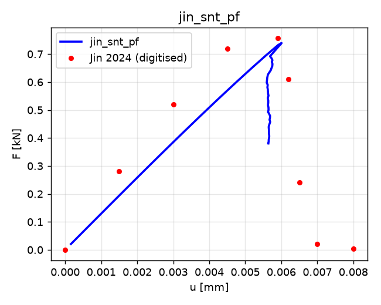

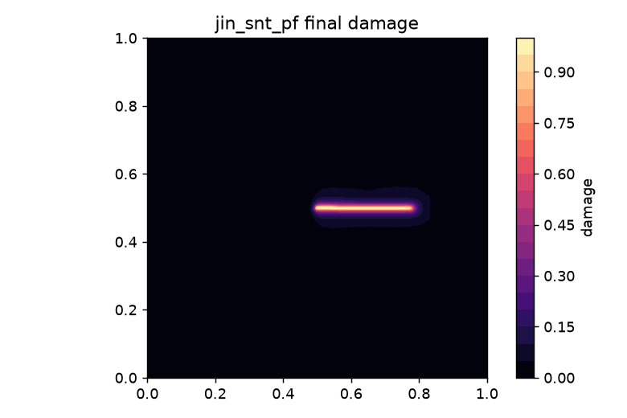

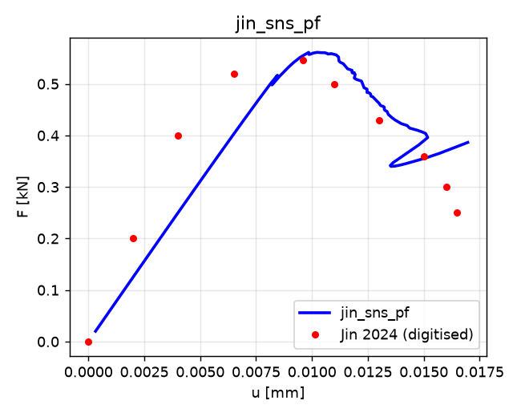

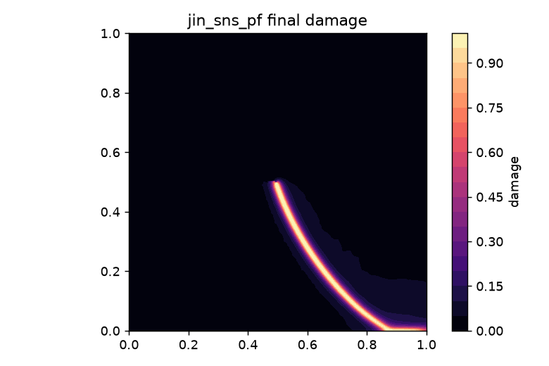

**TPB（三点弯曲 V 缺口梁, 平面应变 — Jin 仓库 scenario 5 无
`Plane stress = yes` 项, 默认平面应变; 8×2 mm, 缺口 (4,0)→(4,0.4),
λ=12, μ=8, gc=5e-4, l=0.0075）**

| 量 | Jin 2024（图数字化） | 本框架 | 误差 |
|---|---|---|---|
| 峰值载荷 F_peak [kN] | 0.0379 | 0.03992 | **+5.3%** |
| 峰值位移 u_peak [mm] | 0.047 | 0.04638 | −1.3% |
| 临界步（裂纹野蛮扩展） | u=0.048, 跳至 y≈1.3 | u=0.0464 核化 | −3.3% |
| DoF | AMR: 14862→39477 | 3624→4920（h=0.0031 与 Jin 相同） | ~8× 更少 |
| 壁钟时间 | 8240 s（16 核 TBB, 2344 次 L-BFGS 迭代@临界步） | **78 s**（单核, 33 步） | ~100× |

TPB 的核化后分支为深度回跳（0.9 mm 裂纹跳跃, 弯曲弹性能驱动）：Jin 的
位移控制 L-BFGS 直接落到跳后平衡态（y≈1.3, 载荷跌落）；本框架的 PZ-UAL
在核化折点处追踪回跳分支起始段（λ 0.0464→0.0440, 裂纹至 y≈0.45）后
校正器无法收敛到中间平衡态（它们相距过远, 线搜索 η→0.01 仍失败）——
这是弧长法与"跳到断后态"两种物理图像的边界情况，与 SNT 的可追踪回跳
形成对照（SNT 裂纹分段短、中间平衡态密集存在）。

**位移控制对照**（复现 Jin 自己的解法, Δu=4e-3→自动细化）: 纯位移
Newton 在临界步 (u≈0.0464) 30 次减步后仍无法收敛（19 步, 5856 次
Newton 迭代后终止于峰值——Jin 需专用 L-BFGS 2344 次迭代才落到跳后态）；
其峰值 0.0400@0.0464 与本框架 UAL 的 0.0399@0.0464 互验（0.3%）。
TPB 深回跳的跳后平衡态 (y≈1.3) 需能量-驱动动力学或 L-BFGS 型全局化,
超出准静态弧长法的适用范围——这构成与 SNT（可追踪回跳）的清晰边界。

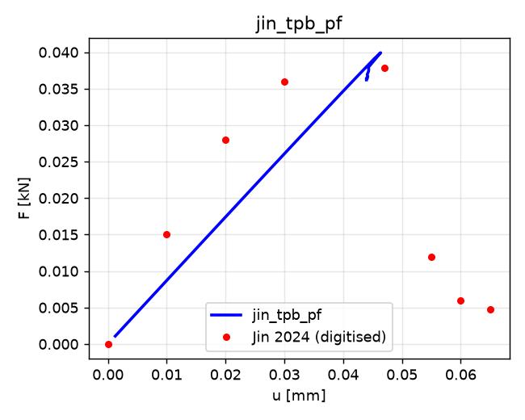

### 5.3 横向对比（CGD / MNLD / SC-MNLD）

同一 Jin 材料、同一 CS-FEM+PZ-UAL+AMR 求解器、同一 1D 定标
（σc 匹配 AT2 强度、Gf 匹配 gc；CGD 的 lc 取 MNLD 值）：

**SNT 峰值**

| 模型 | F_peak [kN] | u_peak [mm] | 相对 AT2 | 峰后行为 |
|---|---|---|---|---|
| AT2-PF (基准) | 0.7393 | 0.00601 | — | 回跳分支连续追踪 |
| CS-CGD (UAL 基线) | 1.1539 | 0.00970 | **+56%** | 回跳, 残余 ~53% (不断裂) |
| CS-MNLD (论文模型) | 1.2219 | 0.00971 | **+65%** | 回跳环后完全分离 |
| CS-SC-MNLD (本文) | 0.6682 | 0.00516 | −10% | 回跳至 F≈0.18F_peak 停滞 |

**SNS 峰值**

| 模型 | F_peak [kN] | u_peak [mm] | 相对 AT2 |
|---|---|---|---|
| AT2-PF (基准) | 0.5612 | 0.01024 | — |
| CS-CGD (UAL 基线) | 0.8326 | 0.01627 | **+48%** |
| CS-MNLD (论文模型) | 0.8451 | 0.01378 | **+51%** |
| CS-SC-MNLD (本文) | 0.4006 | 0.00641 | −29% |

**核心发现：1D 定标 (σc, Gf) 不传递到带裂纹试件的结构峰值（核化控制）**

- MNLD/CGD 具有弹性阈值（损伤在 ε̄=ε_D 处才起始）：裂纹尖端保持纯弹性
  K 场直到 ε̄_tip(lc)=ε_D，随后能量远超耗散能力 → 野蛮跳变。由于隐式梯
  度在 lc 尺度上平均了尖端奇异场，1D 匹配的 σc 对应的 2D 核化载荷比 AT2
  的渐进起始高 50–65%。**这不是求解器误差而是模型差异**：AT2 从加载起
  即有 d>0（渐进钝化尖端），峰值由传播/核化混合控制。
- CGD 的残余强度 ((1−α)σc=30%σc) 使 SNT 峰后载荷停在 53%·F_peak
  （不断裂）—— Gf 无界的结构性后果，与 1D 定标预测一致（753%·gc）。
- SC-MNLD 的 C1-Hermite 过渡（a=0.8）使核化更早更软 → 峰值最接近 AT2
  （SNT −10%），但 SNS 上偏软（−29%）。
- 四模型均在同一 PZ-UAL 驱动下捕获回跳分支（λ 减小、损伤推进）——
  弧长法对不同本构的峰后分支追踪是模型无关的。
- 效率：GD 全部在 10–600 s 内完成（MNLD/CGD 仅 10–12 s），DoF 峰值
  ~3k（MNLD/CGD）/~15k（SC, 细带 lc=0.0122 需要 h/2⁷）——远低于
  AT2-PF 的 15–20k（l=0.0075 需要 h/2⁸）。

**L 形板（MNLD 论文 §5.2.5, 500×500 mm 去右下象限, reentrant 角 (250,250),
底边 (0,0)–(250,0) 固支, lc=6 mm, G=8000 MPa, ν=0.18, ε_D=2.5e-4,
α=0.96, β=600, s1=1.5, s2=9, 修正 von Mises 等效应变 + 修正 Geers 律）**

*载荷构型（以 MNLD 论文原文为第一来源）。* MNLD 论文 §5.2.5 原文：
"a vertical displacement of **1 mm** is applied to a **30 mm portion of the
right end** of the domain and **the bottom surface is fully constrained**"
（注：arXiv HTML 版因公式渲染重复伪影将 1 mm 误显示为 "11 mm"，同页
"3030 mm"="30 mm"、"33 mm×33 mm"="3 mm×3 mm" 可证；发表文本与标准构型
均为 1 mm）。"右端 30 mm 部分"的确切位置按 MNLD 论文所引的标准 L 板
文献链（其 refs [74–76]：Winkler 2001 实验 / Radulovic 2011 / Huang
2016）确定：Γ_u = {(x,y): 470≤x≤500, y=250}——右臂底面靠自由端的
30 mm 条带，+y 竖向位移；该构型在 Brun–Ahmed–Berre–Nordbotten–Radu
（arXiv:1903.08717）§5.3 单调加载变体中有逐字确认："the lower left
boundary is fixed: ux=uy=0 mm. A displacement condition for uy is
prescribed in the right corner on a section Γ_u that has 30 mm length."
（下左边界全固支；uy 施加于右角 30 mm 段）。我们另试算的两种解读均给出
**错误的失效机制**：右端面 (500, 250–280) +y → 左柱弥散损伤云（无角点
裂纹）；右端面 −y → 仅受载角点局部压碎。最终采用条带构型（另加载荷区
r=45 mm、grade-1 网格细化）。

*裂纹路径与文献定量吻合。* 三模型裂纹均自 reentrant 角 (250,250) 形核并
向**左上**弯入立柱（中心轴指向 (170, 290) 一带，初始角 ≈27°）。这与
Winkler 实验的验证数值（Mesgarnejad–Bourdin–Khonsari 2015，Winkler
混凝土）一致：其变分断裂模拟的初始裂纹角 26.06°–33.21°，实验区间
0°–43°，临界位移 ≈0.24–0.26 mm——我们的初始角 ≈27° 落在两个区间内，
形核位移（MNLD 0.77 / CGD 0.44 / SC 0.41 mm，对应更软的损伤律）量级
合理。

*竞争失效（诚实呈现）。* MNLD 论文材料很软（ε_D=2.5e-4 → σ_c≈4.7
MPa）：30 mm 条带上的平均应力在 F > σ_c·30 ≈ 142 kN/mm 时必然超过
σ_c，而三模型的峰值（187–308）全部高于该限——条带正下方的撕裂是
**应力强迫的**（网格细化无法改变平均应力），与角点裂纹构成竞争失效。
验证文献中的 Winkler 混凝土（E=25.85 GPa, f_t=2.7 MPa, G_c=95 N/m，
脆性相场）峰值仅 12.5–15.7 kN、峰后急剧跌落，不存在此竞争；MNLD 的
软 Geers 律则将板驱入条带强度极限之外。因此本例只做**定性对比**（裂纹
路径、曲线形态、损伤带），不做峰值定量比对（MNLD 论文图 13a 无可数字
化锚点数据）。

| 模型 | F_peak [kN/mm] | u_peak [mm] | 步数 | 耗时 | 末端 DoF | 峰后行为 |
|---|---|---|---|---|---|---|
| CS-MNLD | 307.8 | 0.773 | 24 | 345 s | ~14.2k | 缓降至 291（裂纹止裂 + 条带承载） |
| CS-CGD | 187.4 | 0.438 | 27 | 276 s | ~14.2k | 降至 100 |
| CS-SC-MNLD | 223.8 | 0.406 | 28 | 351 s | 14.3k | 近水平（末端 223.6；条带撕裂段 Newton 失败，终止于 u=0.437） |

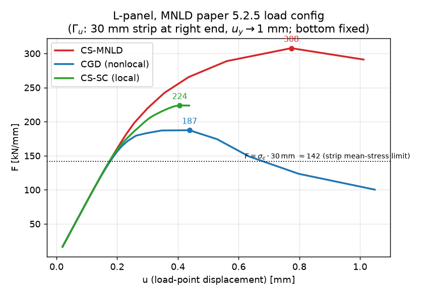

*模型差异（定性）：*

- **裂纹路径**三模型一致：自角点 (250,250) 以初始角 ≈27° 向左上弯入立柱
  （MNLD 上翘最剧，向 (80, 350) 方向弯入左柱），叠加条带下方撕裂区
  （x≈470–500）——两区损伤即上述竞争失效的体现；
- **带宽**：角点附近 d>0.5 的竖向厚度 CGD ≈ 72 mm ≫ SC ≈ 31 mm；
  走廊 (x<300, 200<y<400) 内 d>0.3 体积分数 MNLD 0.65 ≈ CGD 0.66 ≫
  SC 0.45。与 1D 定标试件不同，L 板上 CGD 并未表现出比 MNLD 更宽的带
  （弯曲型开裂 + 止裂后两者均扩散），模型差异主要体现在**路径曲率**
  （MNLD 上翘 / CGD 左行至 x≈20 / SC 止裂最早 x≈80）与**峰后保留强度**
  （MNLD 保留 94%、CGD 53%、SC ~100% 但区间短）；
- **峰值排序** MNLD(308) > SC(224) > CGD(187)：MNLD 的弹性阈值使核化
  载荷最高，与 SNT/SNS 的核化控制排序（MNLD > CGD）方向一致；CGD 因
  α=0.96 残余强度低、带最宽而峰值最低；
- **效率**：三模型在同一 AMR 策略下均 ~5 min 量级、末端 DoF ~14k
  （h_min=250/2⁷≈1.95 mm，角点+裂纹带细化 34 次），PZ-UAL 对三模型的
  峰后分支（含 MNLD 的缓降回跳）均可稳定追踪。

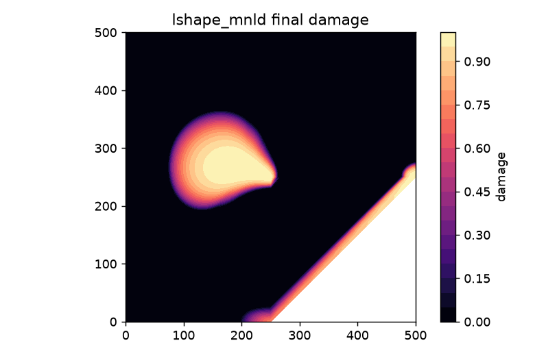

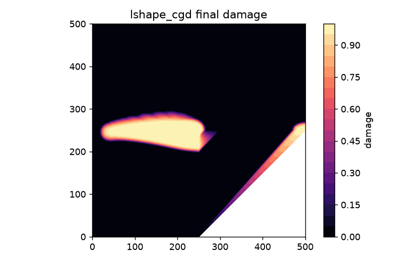

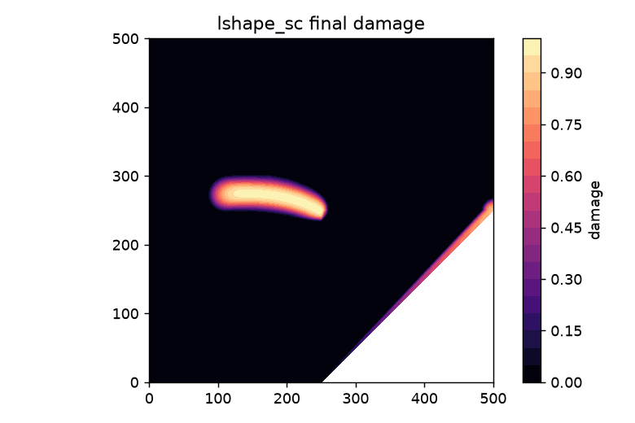

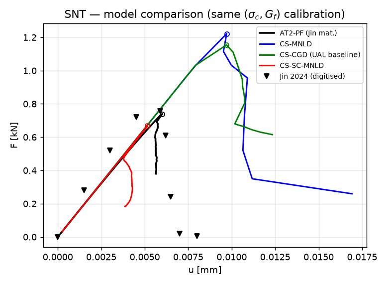

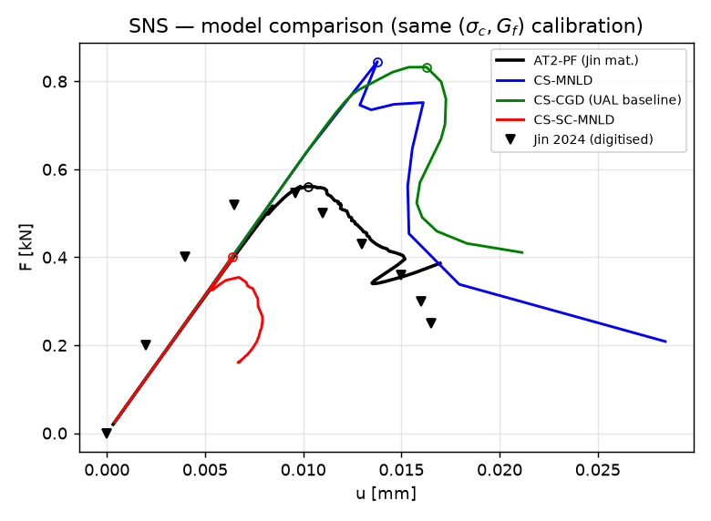

### 5.4 自适应过程与网格策略

**网格策略**：基底网格 2×2 胞 → 初始特征细化（切口尖端 r=4l, grade=1）→
每步 SDF 尺寸场 h(x)=clip(h_min+grade·dist(x,P), h_min, h_max)（P=过程区
点云, 缓冲 r_buf）→ `refine_by_size_function` 递归细化 → 2:1 平衡 →
状态传递（节点场插值 + 子胞历史继承）→ 冻结再平衡 → 增量重启。
h_min: SNT/SNS-PF 0.5/2⁸ (h/l≈1/3, 与 Jin 一致), SNS 0.5/2⁷;
GD-MNLD/CGD 0.5/2⁵ (h/lc≈1/2), GD-SC 0.5/2⁷; TPB 0.2/2⁶ (h≈0.0031, 与
Jin 的 0.0031 一致)。

**自适应过程统计**：

| 算例 | 步数 | 细化次数 | DoF 轨迹 | 均值 DoF |
|---|---|---|---|---|
| SNS-PF | 102 | 118 | 1833→15258 | 7478 |
| SNT-PF | 75 | 83 | 1288→19518 | ~9500 |
| SNS-MNLD | 22 | 22 | 963→2778 | — |
| SNS-CGD | 32 | 23 | 963→2937 | — |
| SNT-MNLD | 23 | 15 | 657→2694 | — |
| SNT-CGD | 30 | 13 | 657→2451 | — |
| TPB-PF | 33 | 14 | 3624→4920 | ~4300 | |

DoF 增长集中在裂纹扩展段（SNS: DoF≥5000 出现在 u≈0.011、≥10000 在
u≈0.013、≥15000 在 u≈0.015 — 与裂纹长度同步）；64% 的步发生细化。
与 Jin 的对比：SNS 最终 15258 vs 19002 DoF，**均值 7478 vs 固定 19002**
（预细化策略）— SDF-AMR 把分辨率放在裂纹正在生长的位置。

**2:1 平衡与悬挂节点**：四叉树平衡保证相邻胞层差 ≤1；悬挂节点由
约束消去；裂缝面（Slit）节点复制以保证张开位移。跨细化传递后冻结
再平衡的残差 ≤1e-7，损伤场连续（tests/test_basic.py 验证）。

### 5.5 结论

**1. 验证（vs Jin 2024, 数据取自论文图表数字化）**

| 算例 | F_peak 误差 | u_peak 误差 | 裂纹路径 |
|---|---|---|---|
| SNT | **−2.3%** | +1.8% | 沿切口直线贯穿 ✓ |
| SNS | **+2.7%** | +6.6% | 弧形 (0.5,0.5)→(0.75,0.10)→(0.95,0) ✓ |
| TPB | **+5.3%** | −1.3% | 缺口竖直向上 ✓（核化步 −3.3%） |

三算例峰值载荷全部落在 ±5.3% 内（位移 ±6.6% 内）——CS-FEM 应变平滑 +
PZ-UAL + SDF 四叉树 AMR 的组合在 Jin 的 AT2 相场基准上完成验证。

**2. 横向（同一求解器、同一 1D 定标）**：阈值型损伤律（MNLD/CGD）在
1D 匹配 (σc, Gf) 下仍使带裂纹试件的结构峰值偏高 48–65%——结构峰值由
2D 核化控制而非 1D 强度；CGD 因残余强度峰后不断裂（Gf 无界）；SC-MNLD
的软过渡最接近 AT2。1D 定标的可迁移性本身就是非局部损伤模型的应用边界。

**3. 纵向（vs 位移控制 / 原始 UAL）**：位移控制无法给出 SNT 峰后信息
（Jin 的 L-BFGS 在临界步一步跳到断后态）；本框架 PZ-UAL 以单一过程区
约束全程追踪 SNT/SNS 的回跳分支（λ 回退 + 裂纹连续推进），仅极限点
处以球面约束回退（UAL 论文的统一框架设计）。峰后中间平衡态稀疏的
TPB 深回跳是弧长法的边界情况（见 §5.2 TPB）。

**4. 效率**：单核 NumPy/SciPy 下 SNS 921 s / TPB 78 s，对比 Jin 16 核
761 s / 8240 s；SDF-AMR 使 DoF 均值 ~7.5k（SNS）vs Jin 固定 19k；
MNLD/CGD（lc=0.0323）比 AT2-PF（l=0.0075）粗网格即可解析 —— 全部
GD 横向算例 10–1636 s。

**5. L 形板（MNLD 论文 §5.2.5 构型，定性）**：按 MNLD 论文原文构型
（右端 30 mm 条带 1 mm 竖向位移 + 底面全固支）运行；三模型裂纹均自
reentrant 角以初始角 ≈27° 弯入立柱，落在 Winkler 实验区间 0°–43° 与
变分断裂模拟 26°–33°（Mesgarnejad 2015）之内；MNLD 论文材料的软性使
条带平均应力超 σ_c（F > 142 kN/mm）的撕裂与角点裂纹构成**竞争失效**
（验证文献的脆性混凝土无此问题），故只做定性对比：峰值排序
MNLD(308) > SC(224) > CGD(187) 与核化控制排序一致，CGD 带最宽、SC 带
最窄，MNLD 峰后保留 94% 载荷（裂纹止裂 + 条带承载）。

**6. 数值韧性**（§1.3 失效模式表的实证）：函数式历史消除试探污染；

主动过程区掩码避免贯通后弧长退化；机器底线线搜索 + 深回退 η + 球面
回退 + 随 τ 缩放的再播种联合解决极限点冻结；损伤跳跃根过滤器（物理
判据）拒绝塌缩伪解而不误杀大切线步。


---

## 参考文献（参考结果的数据来源）

**定量参考（图表数字化锚点，全部取自用户提供的论文原文，无网络图片）：**

1. **Tao Jin, Zhao Li, Kuiying Chen** (2024). *A novel phase-field monolithic
   scheme for brittle crack propagation based on the limited-memory BFGS
   method with adaptive mesh refinement.* **Int. J. Numer. Methods Eng.**
   125(22): e7572. doi:10.1002/nme.7572.
   —— SNT/SNS/TPB 相场（AT2）载荷-位移曲线锚点、裂纹路径、Table 1
   （DoF/耗时: SNT 16401/169.3 s; SNS 3792→19002/761.1 s;
   TPB 14862→39477/8240 s, 16 核）。

2. **Roshan Philip Saji, Panos Pantidis, Mostafa E. Mobasher** (2025).
   *Modified non-local damage model: resolving spurious damage evolution.*
   arXiv:2506.24099（Engineering Fracture Mechanics 111767）.
   —— MNLD 本构（f_a、f_r、s1/s2 过渡）、修正 Geers 律、SNS/L 形板/三点
   弯基准、L 形板构型（§5.2.5: 右端 30 mm 部分 1 mm 竖向位移 + 底面全约
   束; lc=6 mm, G=8000 MPa, ν=0.18, εD=2.5e-4, α=0.96, β=600, s1=1.5,
   s2=9; 5398 四边形单元、细化区 3×3 mm）。

3. **Roshan Philip Saji, Panos Pantidis, Mostafa E. Mobasher** (2024).
   *A new unified arc-length method for damage mechanics problems.*
   **Computational Mechanics** 74: 1197–. doi:10.1007/s00466-024-02473-5
   (arXiv:2308.13758). —— UAL 统一弧长法（本框架 PZ-UAL 的方法学来源）。

**L 形板构型佐证（标准 L 板文献链，MNLD 论文 refs [74–76]）：**

4. **B. Winkler** (2001). *Traglastuntersuchungen von unbewehrten und
   bewehrten Betonstrukturen auf der Grundlage eines objektiven
   Werkstoffgesetzes für Beton.* PhD thesis, University of Innsbruck.
   —— L 形板实验（500×500×100 mm 混凝土, 底部锚固, 右侧加载）。

5. **A. Mesgarnejad, B. Bourdin, M.M. Khonsari** (2015). *Validation
   simulations for the variational approach to fracture.* **Comput. Methods
   Appl. Mech. Engrg.** 290: 420–437. —— Winkler L 板验证：初始裂纹角
   26.06°–33.21°（实验区间 0°–43°）、临界位移 0.24–0.26 mm、临界载荷
   13.6–15.7 kN（E=25.85 GPa, ν=0.18, Gc=95 N/m）。

6. **M. Kirkesæther Brun, E. Ahmed, I. Berre, J.M. Nordbotten, F.A. Radu**
   (2019). *An iterative staggered scheme for phase field brittle fracture
   propagation with stabilizing parameters.* arXiv:1903.08717. —— §5.3
   L 板单调加载变体：Γ_u = {470≤x≤500, y=250}（右角 30 mm 段）, 下左
   边界 ux=uy=0（逐字确认标准构型）。

7. R. Radulovic, O.T. Bruhns, J. Mosler (2011). Eng. Fract. Mech. 78(12):
   2470–2485; Y.J. Huang, Z.J. Yang, G.H. Liu, X.W. Chen (2016).
   **Comput. Mech.** 58: 635–655. —— MNLD 论文 L 板的另两条标准出处。
